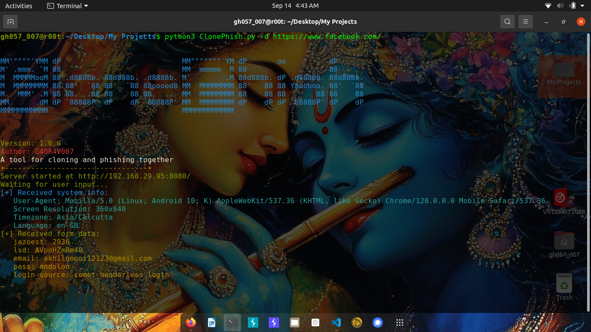

# ClonePhish

**ClonePhish** is a Python tool designed for social engineering and educational purposes. It allows users to clone websites, host them locally, and capture user inputs and system information for analysis.


## Features

- **Clone and Host Websites Locally:** Create local copies of websites to test and analyze.
- **Capture and Log System Details:** Collect information such as User-Agent, screen resolution, timezone, and language.
- **Record User Inputs:** Capture data entered into forms, including emails, passwords, and other sensitive information.
- **Redirect Users:** Automatically redirect users to the original website after form submission.

## ⚠️ **Important: Ethical Use Only!**

`ClonePhish` is intended solely for educational and research purposes within controlled environments. Always ensure you have explicit permission before using this tool. Unauthorized use for phishing or other malicious activities is illegal and unethical.

## Installation

1. **Clone the Repository:**

   ```bash
   git clone https://github.com/0xgh057r3c0n/ClonePhish.git
   cd ClonePhish
   ```

2. **Install Dependencies:**

   Ensure you have Python 3.x installed. Then install the required packages:

   ```bash
   pip install -r requirements.txt
   ```

## Usage

1. **Clone a Website and Start the Server:**

   Run the script with the `-d` option to specify the domain of the website you want to clone:

   ```bash
   python3 ClonePhish.py -d http://example.com
   ```

2. **Access the Cloned Website:**

   Once the server is running, you can access the cloned site locally. The tool will log system information and user inputs to Terminal. You can access the cloned site by navigating to `http://192.168.29.95:8080/` popping in your terminal to your web browser.


## Example Output

**Terminal Output:**

```
[+] Received system info:
   User-Agent: Mozilla/5.0 (X11; Ubuntu; Linux x86_64; rv:130.0) Gecko/20100101 Firefox/130.0
   Screen Resolution: 1366x768
   Timezone: Asia/Kolkata
   Language: en-US

[+] Received form data:
   email: user@example.com
   password: secret123
```

## Contributing

Feel free to contribute to the project by submitting issues, suggestions, or pull requests. Ensure that any contributions adhere to ethical guidelines.

## License

This project is licensed under the MIT License. See the [LICENSE](LICENSE) file for details.

## Disclaimer

This tool is intended for ethical use and educational purposes only. The author and contributors are not responsible for any misuse of the tool. Always use responsibly and with proper authorization.

## Contact

For questions or feedback, please reach out via [GitHub Issues](https://github.com/0xgh057r3c0n/ClonePhish/issues) or contact the author directly.

Stay ethical and secure in your cybersecurity practices! 🔐
